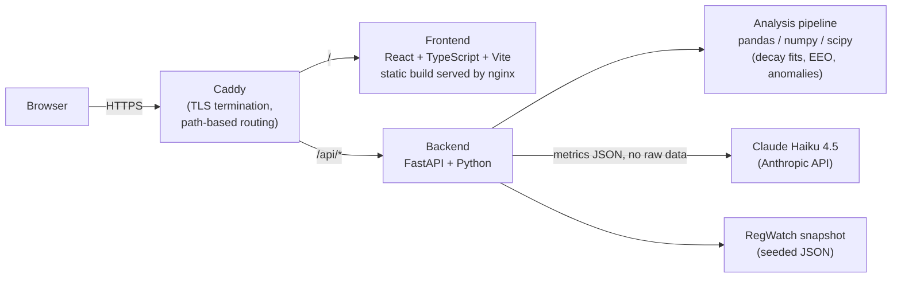

# ReportForge — PFAS Lab Intelligence Suite


**Live demo:** https://reportforge.duckdns.org — no login, no setup, click "Load demo dataset."

> **Unsolicited demo built by a candidate applying to PFASuiki for Cloud & Data Engineering.**
> Not affiliated with or endorsed by PFASuiki. Fake data, real pipeline.


## Why this exists

PFASuiki builds electrochemical oxidation (EO) systems that destroy PFAS ("forever
chemicals") in contaminated water. Their Cloud & Data Engineering role calls for GCP/Firebase
infrastructure work, a TypeScript/JS lab data platform, Python data pipelines, and — explicitly
— identifying and implementing LLM integrations for data synthesis and automated reporting.

Rather than describe that I can do this work, I built a small but complete version of it:
upload (or simulate) electrochemical PFAS degradation experiment data, get back real computed
degradation kinetics and anomaly detection, and an AI-generated lab report grounded in that
data — plus a regulatory-intelligence feed for the second half of the stated role.

## What it does

**Lab Report Generator** — Upload a CSV of electrochemical PFAS degradation runs (or load the
bundled demo dataset: 3 runs, PFOA/PFOS/PFHxS, one clean run, one with electrode fouling, one
with a flow interruption). The backend fits first-order decay kinetics, computes EE/O (energy
per order of magnitude removed — the standard figure of merit in electrochemical water
treatment), detects electrode wear trends and anomalies (voltage spikes, pH excursions, flow
interruptions), then hands the computed metrics — never raw data — to Claude to write a
structured 7-section lab report. If no LLM key is configured or the call fails, it falls back
to a deterministic template report built from the same metrics, so the app never breaks.

**RegWatch** — A digest of PFAS regulatory, legal, scientific, and industry news, filterable by
category. Ships as a seeded snapshot (live RSS fetch was scoped out — see
[Scope decisions](#scope-decisions) below).

## Architecture



Deployed as two Docker containers on a small VPS, both joined to a shared Docker network with
no host ports published — Caddy is the only public surface, terminating TLS and reverse-proxying
by path. Full deployment notes: [`deploy/README.md`](deploy/README.md).

### Stack mapping to PFASuiki's actual infrastructure

| PFASuiki's stated stack | This demo | Notes |
|---|---|---|
| TypeScript/JS lab data platform | React + TypeScript + Vite + Tailwind | Direct match |
| Python data pipelines | FastAPI + pandas + numpy + scipy | Direct match — real kinetics fitting, not mocked |
| GCP Cloud Run | Docker Compose on a VPS | Same containerized model; the backend `Dockerfile` is Cloud-Run-ready as-is |
| Firebase Hosting | Static Vite build served by nginx, behind Caddy | Same "static SPA" hosting pattern |
| Firestore | None — stateless, CSV/JSON in, JSON out | No persistent app data needed at this scope |
| LLM/AI integration for reporting | Claude Haiku 4.5 via the Anthropic API | The role's explicitly-named requirement |

## Running it locally

Requires Docker.

```bash
git clone https://github.com/nabeelahmad123/report_forge.git
cd report_forge
cp backend/.env.example backend/.env   # optional: add ANTHROPIC_API_KEY for real LLM output
docker compose up
```

Frontend at `http://localhost:5173`, backend at `http://localhost:8000` (interactive API docs
at `/docs`). Without an API key, `/report` still works end-to-end via the template fallback.

Backend tests: `cd backend && uv run pytest` (24 tests, no external dependencies — the LLM path
is always mocked, never a real network call).

## Scope decisions

- **RegWatch ships as a static snapshot, not a live RSS feed.** Explicitly scoped as optional
  in the original spec; the snapshot alone demonstrates the same data modeling and UI.
- **No auth.** Zero demo value for a portfolio piece, and it's the first thing to cut under a
  time budget.
- **`/report` has a spend cap independent of the per-IP rate limit** (`MAX_LLM_SPEND_USD`,
  in-memory, default $5) — it's a public, unauthenticated endpoint that calls a paid API, so a
  ceiling on total spend matters more than how many different IPs could theoretically hit it.

## Contact

Nabeel Ahmad — [nabeel5003143@gmail.com](mailto:nabeel5003143@gmail.com) ·
[github.com/nabeelahmad123](https://github.com/nabeelahmad123)
